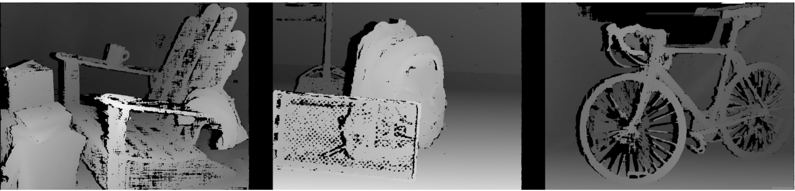

# 视障人士通行辅助系统
成员：谷莘、杨杰、佟一飞

指导老师：朱光辉

报告撰写：谷莘

本项目实现了一种基于香橙派 AIPro 平台的视障人士通行辅助系统。整个项目完成了包括模型训练、模型部署、播报逻辑设计、信息流处理在内的所有任务，整个系统能够正常工作。

## 任务分工
谷莘（队长）：训练集筛选拼接、模型环境部署及代码编写、信息流处理

杨杰：播报逻辑设计、模型生成信息转译

佟一飞：模型训练相关事宜、数据分析

## 环境部署

项目的文件根目录为lier_workload,我们将它放置在root用户的任意目录下即可；

### 硬件依赖

我们需要一个usb-a接口的摄像头和一个usb-a接口的音频输出设备（注意不能使用3.5mm接口，这是由于orange pi的一些奇怪的特性导致的）接入到香橙派开发板上。当然，即使没有这些设备，我们也可以单独地测试每个模块的可用性。

### Ascend-cann-toolkit的安装

我们CANN的版本选用8.0.0.alpha003，我们从华为官网下载安装包
Ascend-cann-toolkit_8.0.0.alpha003_linux-aarch64.run， 执行以下操作：

```bash
#添加执行权限
chmod +x Ascend-cann-toolkit_8.0.0.alpha003_linux-aarch64.run
#检查软件包
./Ascend-cann-toolkit_8.0.0.alpha003_linux-aarch64.run --check
#安装软件包
./Ascend-cann-toolkit_8.0.0.alpha003_linux-aarch64.run --install
#变更系统环境
source /usr/local/Ascend/ascend-toolkit/set_env.sh
```

### 第三方依赖安装

设置环境变量，配置程序编译依赖的头文件，库文件路径。“$HOME/Ascend”请替换“Ascend-cann-toolkit”包的实际安装路径。

   ```
    export DDK_PATH=$HOME/Ascend/ascend-toolkit/latest
    export NPU_HOST_LIB=$DDK_PATH/runtime/lib64/stub
    export THIRDPART_PATH=${DDK_PATH}/thirdpart
    export LD_LIBRARY_PATH=${THIRDPART_PATH}/lib:$LD_LIBRARY_PATH
   ```
   创建THIRDPART_PATH路径

   ```
    mkdir -p ${THIRDPART_PATH}
   ```
- acllite

    注：源码安装ffmpeg主要是为了acllite库的安装
    执行以下命令安装x264

    ```bash
    # 下载x264
    cd ${HOME}
    git clone https://code.videolan.org/videolan/x264.git
    cd x264
    # 安装x264
    ./configure --enable-shared --disable-asm
    make
    sudo make install
    sudo cp /usr/local/lib/libx264.so.164 /lib
    ```   
    执行以下命令安装ffmpeg

    ```bash
    # 下载ffmpeg
    cd ${HOME}
    wget http://www.ffmpeg.org/releases/ffmpeg-4.1.3.tar.gz --no-check-certificate
    tar -zxvf ffmpeg-4.1.3.tar.gz
    cd ffmpeg-4.1.3
    # 安装ffmpeg
    ./configure --enable-shared --enable-pic --enable-static --disable-x86asm --enable-libx264 --enable-gpl --prefix=${THIRDPART_PATH}
    make -j8
    make install
    ```   
   执行以下命令安装acllite

    ```bash
    cd ${HOME}/samples/inference/acllite/cplusplus
    make
    make install
    ```

- opencv

  执行以下命令安装opencv(注:确保是3.x版本)
  ```bash
  sudo apt-get install libopencv-dev
  #python版本也要安装
  pip install opencv-python
  ```   

- espeak-ng
  
  这是一个文字转语音的轻量化插件，通过以下方式安装：
  ```bash
  apt install espeak-ng
  ```

- shapely
  
  这是一个用于碰撞检测的包，通过以下方式安装：
  ```bash
  pip install shapely
  ```

### 项目运行

整个项目可以通过脚本直接进行运行：
```bash
bash start.sh
```
在start脚本中我们对环境变量进行了设置，完成了代码编译并直接执行，如果各个模块的环境和硬件没有问题，我们可以直接运行整个项目。

除此之外我们可以对各个模块进行分别测试：

- 推理模块
    ```bash
    #切换到模型部署文件夹中
    cd ascend-yolov8-sample/
    #模型文件放在model文件夹下（yolov8n.om），待推理的图片放在data目录下
    cd src
    #编译项目
    cmake .
    make
    cd ../out
    ./main
    #得到执行结果，图片就保存在out文件夹下，框的位置也会在终端中被打印
    ```
- 摄像模块
  ```bash
  #将拍摄的图片保存在当前根目录
  python camera_test.py
  ```
- 语音模块
  ```bash
   #将声音test.wav保存在当前根目录下
   python tts_test.py --save
   #直接播放声音
   python tts_test.py
  ```
- 碰撞模块
  ```bash
   #在画板上绘画出现在的参数下碰撞区域的划分，保存在divided_image.png中
   python area_test.py
  ```

## 实现流程

### 模型训练

#### version 1

我们初版的模型的数据来源如下：

COCO (Common Objects in Context)  
COCO是一个广泛使用的目标检测和分割数据集，包含多种日常生活中的物体，适合训练和评估对象检测模型。

- COCO 数据集 [COCO官网](https://cocodataset.org/#home)

TT100K (Traffic Signs Dataset)  
TT100K是一个专注于交通标志的图像数据集，包含丰富的交通环境样本，非常适合用于训练交通信号识别模型。

- TT100K 数据集 [TT100K官网](https://cg.cs.tsinghua.edu.cn/traffic-sign/tutorial.html)

Bosch Small Traffic Lights Dataset  
Bosch数据集专注于交通信号灯的检测，数据集中的图像包括多种不同类型和状态的信号灯，适用于交通环境下的目标检测任务。

- Bosch信号灯数据集 [Bosch官网](https://github.com/bosch-ros-pkg/bstld)

最终模型的标签如下：

["stop_sign","person","bicycle","bus","truck","car","motorbike","reflective_cone", "ashcan","warning_column", "spherical_roadblock","pole","dog", "tricycle","fire_hydrant","red","green"]

训练结果如下：


从confusion矩阵中我们观察到，对于红绿灯图像的训练是十分失败的，而且个别标签的background值很高，为了解决这些问题，我们进行了第二次的训练

#### version 2
我们分析了上一次训练失败的原因，很可能是由于我们选用的红绿灯数据集boston是基于德国的街景设计的，交通灯的型号很小，不适应国内的交通灯环境。

于是，我们将交通灯的数据修改为了根据国内的街景标注的数据集，并且新增了让人行横道以及指示路标的识别，以下是数据集来源：

CDSet数据集(Crosswalk Detection DataSet)
含3434张斑马线的图像数据集。在车载摄像头上采集到的斑马线图像，用于研究先进的斑马线目标检测和汽车过线行为分析的深度学习算法。

- CDSet数据集 [数据集地址](https://zenodo.org/records/8289874)

最终模型的标签如下：

["stop_sign", "person", "bicycle", "bus", "truck", "car", "motorbike", "reflective_cone", "ashcan", "warning_column", "spherical_roadblock", "pole", "dog", "tricycle", "fire_hydrant", "red_light", "green_light", "crosswalk", "guide_arrows"]

训练结果如下：


我们可以看到，红绿灯的训练较为成功，但仍有一些标签存在background值很高的情况。经过我们的分析，可能的原因是当我们将不同的数据集拼接时，可能存在这种情况：红绿灯数据集中的图片红绿灯被框出，但照片中的车以及其他实物并没有被框出。这个问题暂时没有得到解决，有待后续的进一步探索。

可能的解决方案是实现质量更高的数据集，通过手动框图避免上面提到的问题。但这一方案的实现成本较高，未能得到实现。

### 模型部署

#### 模型环境部署

详情见上文提到的环境部署；除了少数软件包之外，所有的部署流程都是为模型推理服务的；

#### 模型转换

我们通过上述的模型训练得到onnx模型文件，并保存在项目路径的atc文件夹中，随后进行以下操作：

```bash
#aipp.cfg文件保存在atc目录下，input_shape由模型文件的结构得出
atc --model=yolov8n.onnx --framework=5 
--output=yolov8n 
--input_shape="images:1,3,640,640"  
--soc_version=Ascend310B1 
--insert_op_conf=aipp.cfg
```

#### 执行代码

我们的代码参考了昇腾官方的样例[sampleYOLOV7](https://gitee.com/ascend/samples/tree/master/inference/modelInference/sampleYOLOV7),下面我简略介绍一下我们的实现方式：

- 将样例中的label.h进行修改：
  ```cpp
  #ifndef modelInference_label_H
  #define modelInference_label_H
  using namespace std;
  const string label[] = {"stop_sign", "person", "bicycle", "bus", 
        "truck", "car", "motorbike", "reflective_cone", 
        "ashcan", "warning_column", "spherical_roadblock", "pole", 
        "dog", "tricycle", "fire_hydrant", "red_light", "green_light", 
        "crosswalk", "guide_arrows"};


  #endif //modelInference_label_H
  ```

- 对sampleYOLOV7.cpp进行修改：
- 
  ```cpp
  //改变模型的接口
  class SampleYOLOV8{
    public:
        SampleYOLOV8(const char *modelPath, const int32_t modelWidth, const int32_t modelHeight);
        Result InitResource();
        Result ProcessInput(string testImgPath);
        Result Inference(std::vector<InferenceOutput> &inferOutputs);
        Result GetResult(std::vector<InferenceOutput> &inferOutputs, string imagePath, size_t imageIndex, bool release);
        ~SampleYOLOV8();
    private:
        //...
    }
    //...
    //将模型的推理结果保存在目标文件中，以待后续分析：
    for (size_t i = 0; i < result.size(); ++i) {
        cv::Point leftUpPoint, rightBottomPoint;
        leftUpPoint.x = result[i].x - result[i].width / half;
        leftUpPoint.y = result[i].y - result[i].height / half;
        rightBottomPoint.x = result[i].x + result[i].width / half;
        rightBottomPoint.y = result[i].y + result[i].height / half;
        //...
        outFile << "Name: " << imageName << ", boxName:" << className
               << ", Original Width: " << srcWidth
               << ", Original Height: " << srcHeight 
               << ", X: " << leftUpPoint.x 
               << ", Y: " << leftUpPoint.y 
               << ", Width: " << result[i].width 
               << ", Height: " << result[i].height 
               << std::endl; // 换行
    }  
    outFile << std::endl;//每个图片输出完成后换行
    outFile.close();
  ```

#### 运行结果
直接运行模型脚本，得到的结果如下：

```
(base) root@orangepiaipro-20t:/home/HwHiAiUser/lier_workload/ascend-yolov8-sample/out# ./main
[INFO]  Acl init ok
[INFO]  Open device 0 ok
[INFO]  Use default context currently
[INFO]  dvpp init resource ok
[INFO]  Load model ../model/yolov8n.om success
[INFO]  Create model description success
[INFO]  Create model(../model/yolov8n.om) output success
[INFO]  Init model ../model/yolov8n.om success
[INFO]  成功过滤置信度阈值 > 0.300000 的框，框的数量为 10
[INFO]  成功过滤NMS阈值 > 0.450000 的框，结果数量为 1
[INFO]  对象检测 [0.854492:car] 成功
[INFO]  Inference elapsed time : 0.092932 s , fps is 10.760523
[INFO]  Unload model ../model/yolov8n.om success
[INFO]  destroy context ok
[INFO]  Reset device 0 ok
[INFO]  Finalize acl ok
```

### 推理信息转译
对于一张推理过图片，我们将图片用四条直线划分成五个区域,示意图如下：


四条直线的位置和斜率由图像的大小以及摄像头的焦距决定。五个区域分别为偏左、中左、中心、中右、偏右。我们根据每个框的底边和五个区域的碰撞来判定这个框代表的实物被划分在哪个区域。最终，根据每个区域的物品分布，给出适宜的播报提示。碰撞的实现逻辑如下：

```python
left_polygon = Polygon([(0, original_height), (0, max_height), (bottom_left1_X, original_height), (top_left1_X, max_height)])
little_left_polygon = Polygon([(bottom_left1_X, original_height), (top_left1_X, max_height), (bottom_left2_X, original_height), (top_left2_X, max_height)])
#......
```

我们利用polygon的多边形库来检测碰撞，最后得到不同物品在区域内的分布情况。

播报的简要逻辑如下：

```Mermaid
flowchart TD
    A[Start] --> B{Does the item set contain a crosswalk?}
    B -- Yes --> C{Is there a red or green light?}
    C -- Yes --> D[Announce the red or green light status]
    C -- No --> E[End]
    B -- No --> F[Check the distribution of obstacles in five regions]
    F --> G{Select the region closest to the center without obstacles}
    G --> H[Announce the selected region]
    H --> E

    style D fill:#f9f,stroke:#333,stroke-width:2px;
    style H fill:#9f9,stroke:#333,stroke-width:2px;

```


### 数据流处理

我们编写了一个move.py脚本来调度所有模块，move.py的运作方式如下：

```Mermaid
sequenceDiagram
    loop 每个循环
        participant OpenCV
        participant Move
        participant Main
        participant EspeakNG

        OpenCV->>Move: 拍摄照片
        Move->>Main: 发送照片
        Main->>Move: 返回推理结果
        Move->>EspeakNG: 将推理结果转化为文字，发送文字
        EspeakNG->>EspeakNG: 转化为语音并播报
    end
```


每个循环会生成一次播报，如此循环往复；

## 未来的改进方案

### 播报逻辑

我们本来的实现方案是利用单目测距来确定每个框的位置，最后进行播报，原理图如下：


但是由于我们的摄像头的不稳定性，单目测距的结果的不稳定性极差，最终我们舍弃了单目测距的方案，实现了现在的分区判断方案，但这种方案也存在对距离判断不敏感的问题。

这一问题的解决方案是使用双目测距：


根据双目测距，我们能得到图像上每个位置的景深，从而精准地判断出每个框距离人的横向距离和纵向距离，给出极为精准的移动播报，**让我们的项目质量得到质的飞跃**：



但由于双目测距模块昂贵的价格，我们决定暂时将这个方案搁置。(／‵Д′)／~ ╧╧


### 数据集问题

我们需要一个高质量的数据集来解决标签存在background值很高的问题。拼接的数据集之间存在未标注的标签，这种情况可能我们需要手动去做数据标注。
<p float="left">
  
  
  
  
</p>

### 